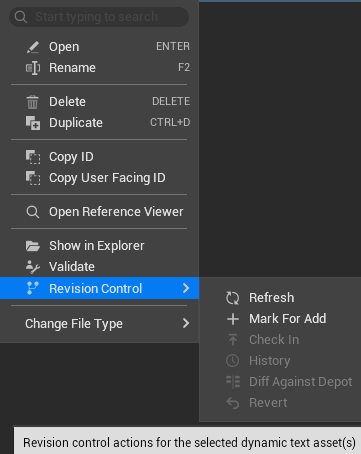

# Dynamic Text Asset Browser

[Back to Table of Contents](../TableOfContents.md)

## Overview

The Dynamic Text Asset Browser (`SSGDynamicTextAssetBrowser`) is the main editor window for viewing and managing all dynamic text assets.
It provides a split-panel layout with a class type tree on the left and an asset grid on the right.

## Opening the Browser

Access the browser from the Window menu or toolbar. The tab is identified as `"SGDynamicTextAssetBrowser"`.

## Layout

### Type Tree (Left Panel)

A hierarchical tree of all registered dynamic text asset classes. Click a class to filter the asset grid to show only assets of that type. The tree shows:

- Base classes and their derived subclasses
- Only classes registered with `USGDynamicTextAssetRegistry`
- Abstract classes appear in the tree but cannot be instantiated
- Non-instantiable types (abstract or root base classes) are included in the tree via `GetAllRegisteredClasses()` rather than only instantiable classes
- Non-instantiable types are rendered with italic font and a subdued foreground color to visually distinguish them
- Each tree item carries a `bIsInstantiable` flag sourced from the registry
- Non-instantiable items are still selectable for filtering purposes. Selecting one shows the files belonging to its child classes
- Hovering over a non-instantiable item displays the tooltip: *"This type is abstract and cannot be instantiated directly."*

### Include Child Types

A checkbox labeled **"Include Child Types"** is displayed above the type tree:

- **Default**: Unchecked.
- **When checked**: `FindAllFilesForClass(..., true)` includes files from subclass folders in the asset grid.
- **When unchecked**: `FindAllFilesForClass(..., false)` shows only files that belong to the exact selected type.
- **Non-instantiable override**: When a non-instantiable type is selected, the checkbox is automatically forced on and disabled, since non-instantiable types have no direct instances of their own.
- **Persistence**: The preference is saved and restored between sessions via `GConfig`.

### Asset Grid (Right Panel)

A tile/grid display of dynamic text assets matching the selected class filter (`SSGDynamicTextAssetTileView`).
Each tile shows the UserFacingId as the display name.

**Search Bar**: A search box at the top of the grid filters the displayed assets.
The search matches against the UserFacingId, ClassName, and `FSGDynamicTextAssetId` string representation.

**Double-click** a tile to open the [Dynamic Text Asset Editor](DynamicTextAssetEditor.md).

#### Tile Status Overlays

Each tile can carry two independent corner overlays. They are driven by separate systems, so a tile may show either, both, or neither.

| Overlay | Corner | Driven by | Shown when |
|---------|--------|-----------|------------|
| **Source-control badge** | Top-left | The active provider's own status icon (`ISourceControlState::GetIcon()`) | The file is tracked and in a state the provider draws a marker for. No badge for a clean/up-to-date file, and no badge when source control is disabled. |
| **Unsaved-change star** | Top-right | Editor dirty state only | An open editor for the file has unsaved edits. Independent of source control, so it appears whether or not source control is enabled. |

The badge is the provider's engine-faithful icon rather than a plugin icon set, so its appearance follows Perforce, Subversion, or Git conventions per provider. For the full per-provider presentation model (which states draw a marker, and why a clean tracked file shows nothing), see the badge-drawing model in [Source Control](SourceControl.md).

The tile tooltip adds two lines below the base asset information when they apply:

- The **source-control line** is taken verbatim from the provider's `ISourceControlState::GetDisplayTooltip()` for the file. It is skipped when source control is disabled. See the tile tooltip section of [Source Control](SourceControl.md) for how this line is sourced.
- The **unsaved-change line** is the shipped string `Has unsaved changes.`, shown when an open editor for the file has unsaved edits.

 

## Toolbar

| Button | Action |
|--------|--------|
| **New** | Opens the Create Dialog to make a new dynamic text asset |
| **Refresh** | Rescans the file system and updates the display |
| **Reference Viewer** | Opens the [Reference Viewer](ReferenceViewer.md) for the selected asset |
| **Show in Explorer** | Opens the file's location in the OS file browser |
| **Rename** | Opens a rename dialog for the selected asset |
| **Delete** | Deletes the selected asset(s) (with confirmation) |
| **Duplicate** | Creates a copy with a new `FSGDynamicTextAssetId` and UserFacingId |
| **Validate All** | Validates every dynamic text asset file in the project (see below) |

### Validate All

The Validate All button (icon-only, right side of toolbar) runs validation across the entire project:

1. Collects all dynamic text asset files via `FSGDynamicTextAssetFileManager::FindAllDynamicTextAssetFiles()`
2. Runs `FSGDynamicTextAssetCookUtils::ValidateDynamicTextAssetFile()` on each file
3. Shows a notification with pass/fail counts
4. On failures, the notification includes an "Open Output Log" hyperlink to view detailed error messages
5. The notification auto-expires after 5 seconds
6. A summary is also logged to the Output Log: `"Validation complete: X passed, Y failed"`

## Context Menu

Right-click an item in the asset grid for additional operations:

- **Open / Edit**: Open in the Dynamic Text Asset Editor
- **Duplicate**: Opens a dialog to enter a new UserFacingId for the copy
- **Rename**: Opens a dialog to enter a new UserFacingId (GUID stays the same)
- **Delete**: Removes the file with a confirmation prompt
- **Validate**: Runs validation on the selected asset(s)
- **Show in Reference Viewer**: Opens the Reference Viewer for this asset
- **Copy ID**: Copies the `FSGDynamicTextAssetId` string to the clipboard
- **Show in Explorer**: Opens the containing folder
- **Convert File Format >**: A submenu listing all registered file formats except the asset's current format and binary.
  The submenu is built dynamically from serializers returned by `FSGDynamicTextAssetFileManager::GetAllRegisteredSerializers()`.
  Each entry is displayed as the format name with its extension (e.g., `"XML (.dta.xml)"`).
  Conversion is performed by `FSGDynamicTextAssetFileManager::ConvertFileFormat()`, which deserializes the file using its current serializer, re-serializes with the target serializer, writes the new file, and deletes the old one.
  Source control integration marks the new file for add and the old file for delete.
  A notification displays the success or failure count after the operation completes.
  Any open editors for the converted file are updated via `NotifyFileRenamed()` so they track the new file path.
- **Revision Control >**: A submenu of source-control actions for the selected asset(s). See below.

### Revision Control Submenu

The **Revision Control** submenu is added to the context menu **only when source control is enabled**. When source control is off it is absent entirely, not shown as a greyed-out entry. Its actions read the same provider state that drives the tile badge and tooltip; see [Source Control](SourceControl.md) for that shared model.

The submenu contains six entries, in this order:

| Entry | Tooltip | Enabled when |
|-------|---------|--------------|
| **Refresh** | Update the revision control status of the selected files | Always, while source control is on. Re-queries provider status for the selected files and refreshes badges, tooltips, and menu enablement. |
| **Mark For Add** | Mark the selected files for add in revision control | Every selected file is untracked (`NotInSourceControl`). Marks the selected files for add. |
| **Check In** | Check in the selected files to revision control | At least one selected file has local changes, using the broader set {checked out, added, locally modified, marked for delete}. This set includes a clean checkout. Opens the engine check-in dialog for the selected files. |
| **History** | View the revision history of the selected files | Every selected file is tracked (under source control). Opens the engine revision-history view. |
| **Diff Against Depot** | Diff the selected file's local working copy against its head depot revision using the external text-diff tool | Exactly one file is selected, it is tracked, and its provider allows diffing against the depot. Multi-select disables it. Launches the configured external text-diff tool comparing the local file to the head depot revision. |
| **Revert** | Discard local changes to the selected files, restoring them to the depot revision | At least one selected file has actual local changes, using the tightened set {added, locally modified, marked for delete}. Prompts for confirmation, reverts, and reloads any open editor for a reverted file so its content and unsaved-change star match disk. |

**Check In vs Revert enable conditions.** These two entries deliberately use different status sets, and the difference is visible in practice:

- **Check In** uses the broader set {checked out, added, locally modified, marked for delete}, which **does** include a clean checked-out file (checked out but unmodified).
- **Revert** uses the tightened set {added, locally modified, marked for delete}, which **excludes** a clean checked-out file. A file that is checked out but unmodified has nothing to revert, so Revert stays disabled for it while Check In is enabled.

**Diff Against Depot is the interim external diff.** It shells out to the configured external text-diff tool and compares the raw on-disk file against the head depot revision as plain text. This is a line-level, format-agnostic view. A DTA-aware, property-level semantic diff is planned as a separate, later effort and is not shipped today; see the diff distinction in [Source Control](SourceControl.md) for how the two differ.

There is deliberately no **Merge** entry. Dynamic text asset payloads are opaque to source control, so a semantic three-way merge does not apply; Revert (discarding local changes wholesale) is the meaningful conflict resolution for these files.

## Create Dialog

The Create Dialog lets you make a new dynamic text asset:

1. **Class Selector**: A searchable list of all instantiable dynamic text asset classes.
2. **UserFacingId Input**: Type a human-readable name.
   The dialog validates that the name is unique within the class folder and contains only valid filename characters.
3. **Format Dropdown**: Selects the file format for the new asset.
   Each option is displayed as `"FormatName (extension)"` (e.g., `"JSON (.dta.json)"`).
   Defaults to `DEFAULT_TEXT_EXTENSION` (`.dta.json`).
   The dropdown queries all registered serializers via `FSGDynamicTextAssetFileManager::GetAllRegisteredSerializers()`.

   > The Format dropdown is **only visible when 2 or more serializers are registered**.
   > When only one serializer is available, the dropdown is hidden and the default format is used automatically.

4. **Create**: Generates a new `FSGDynamicTextAssetId`, creates a file at the appropriate class folder path using the selected format, and opens the editor.

The selected extension is passed to `FSGDynamicTextAssetFileManager::CreateDynamicTextAssetFile()`,
which looks up the registered serializer and uses it to generate format-appropriate default content.

New files are automatically marked for add in source control if enabled.

## Multi-Select

The asset grid supports multi-selection using standard Unreal conventions:

- **Ctrl+Click**: Toggle individual item selection
- **Shift+Click**: Range selection

The status bar at the bottom shows `"X of Y selected"` when multiple items are selected, or `"Y items"` when nothing is selected.

### Operations Supporting Multi-Select

| Operation | Multi-Select | Notes |
|-----------|:------------:|-------|
| Open / Edit | Yes | Opens one editor tab per selected item. Shows a confirmation dialog if more than 10 items are selected. |
| Delete | Yes | Confirmation dialog shows count instead of individual name for bulk deletes. Single refresh after all deletions. |
| Validate | Yes | Validates all selected items as a batch |
| Rename | No | Requires exactly 1 item selected |
| Duplicate | No | Requires exactly 1 item selected |
| Copy ID | No | Requires exactly 1 item selected |

## Keyboard Shortcuts

| Shortcut | Action | Condition |
|----------|--------|-----------|
| **Enter** | Open selected items in editor | 1+ items selected |
| **Delete** | Delete selected items | 1+ items selected |
| **F2** | Rename selected item | Exactly 1 item selected |
| **Ctrl+D** | Duplicate selected item | Exactly 1 item selected |
| **Ctrl+C** | Copy GUID to clipboard | Exactly 1 item selected |
| **Ctrl+A** | Select all visible items | Always |
| **Escape** | Clear all selections | Always |

## Type Tree Search

The type tree panel includes a search box that filters the class hierarchy. The filter is case-insensitive and matches against class display names using substring matching.

The filtering is recursive: `DoesItemOrDescendantMatchFilter()` preserves matching branches, so if a child class matches, its entire parent chain remains visible. `FilterTreeItem()` creates a filtered copy of the tree without modifying the original data. The filter only affects display and does not change the selected type.

## File Format Conversion

The context menu on selected assets includes a **Convert File Format** submenu listing all registered serializer formats (JSON, XML, YAML, and any custom formats).

Selecting a target format calls `FSGDynamicTextAssetFileManager::ConvertFileFormat()`, which round-trips the data through an in-memory provider to produce the new file. Source control integration automatically marks the old file for delete and the new file for add. Batch conversion is supported when multiple assets are selected.

See [Custom Serializer Guide](../Advanced/CustomSerializerGuide.md) for details on format conversion internals.

## Preference Persistence

The **Include Child Types** checkbox state is saved to `GEditorPerProjectIni` under the `[SGDynamicTextAssetsEditor]` section with the key `bIncludeChildTypes`. This setting survives editor restarts and is project-specific.

## Bulk Open Warning

Opening more than 10 items simultaneously triggers a confirmation dialog to prevent accidental editor tab flooding. The threshold is defined by `BULK_OPEN_WARNING_THRESHOLD = 10`.

[Back to Table of Contents](../TableOfContents.md)
