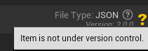
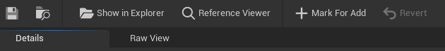

# Dynamic Text Asset Editor

[Back to Table of Contents](../TableOfContents.md)

## Overview

The Dynamic Text Asset Editor (`FSGDynamicTextAssetEditorToolkit`) is a standalone window for editing a single dynamic text asset's properties.
It provides a Details panel for property editing, a Raw View for inspecting the on-disk file content, a toolbar with save, copy, and source-control actions, and an always-visible source-control status indicator in the window header.

## Opening the Editor

- **Double-click** a dynamic text asset in the browser.
- **Context menu > Open** in the browser.
- **Open Editor** button on an `FSGDynamicTextAssetRef` property picker.

The editor deduplicates windows: if an editor is already open for a file, it will be focused instead of opening a duplicate.

## Layout

### Info Bar

Displayed at the top of the editor window:

- **Top Row**: Parent class hyperlink. Clicking the class name opens the corresponding C++ source file.
- **Bottom Row**: A copy button followed by the `FSGDynamicTextAssetId` displayed in monospace font.
  Clicking the copy button copies the ID string to the clipboard.

### Source Control Status Indicator

A standalone source-control status icon lives in the top-right of the toolkit header, alongside the "File Type: <format>" text, its help "?" icon, and the "Version: X" line. Because it is part of the toolkit header rather than a tab, it is **always visible regardless of which tab (Details or Raw View) is active**.

- It renders the active provider's own status icon for the file, matching the browser tile badge. See [SourceControl.md](SourceControl.md) for the shared per-provider presentation and badge-drawing model.
- On hover it shows the provider's status tooltip (from `ISourceControlState::GetDisplayTooltip()`).
- It **self-collapses (shows nothing)** for a clean / up-to-date file, an untracked file, or when source control is disabled.
- Its status updates automatically as the file's source-control state changes; see [SourceControl.md](SourceControl.md) for the automatic status refresh triggers.

### Identity Section

Displayed below the info bar using `FSGDTADetailCustomization`:

- **DynamicTextAssetId**: Read-only, with a copy button to copy to clipboard.
- **UserFacingId**: Read-only display (rename through the browser), with a copy button.
- **Version**: Formatted as `Major.Minor.Patch`, read-only, with a copy button.

### Details Tab

A standard Unreal `IDetailsView` showing all UPROPERTY fields defined on the dynamic text asset subclass.
Properties are organized by category and support all standard property editor features (sliders, color pickers, asset pickers, etc.).

### Raw View Tab

The Raw View tab is stacked with the Details tab. Click the tab header to switch between them.
It shows the **actual on-disk file content** (not the in-memory editor state).

Components:

- **Identity Block** (`SSGDynamicTextAssetIdentityBlock`): Displayed at the top in a bordered box.
  Shows DynamicTextAssetId, UserFacingId, and Version as read-only fields.
- **Notice Banner**: Yellow warning text reading *"If any changes are not saved they will not show up here."*
  Reminds the user that Raw View reflects the disk state, not unsaved editor changes.
- **Text Display**: A read-only `SMultiLineEditableTextBox` with monospace font (size 10) and always-visible scrollbars.
  Displays the full file content as stored on disk.
- **Copy Button**: Floating in the top-right corner. Copies the displayed text to the clipboard.
- **Refresh Button**: Floating next to the Copy button. Re-reads the file from disk and updates both the text display and identity properties. Wired to `FSGDynamicTextAssetEditorToolkit::RefreshRawView()` via the `OnRefreshRequested` delegate.

The Raw View **auto-updates when the file is saved**. After a successful save, `RefreshRawView()` is called to reload the disk content. Users can also manually refresh at any time using the Refresh button.

The Raw View can also be opened in a sidebar panel (`.SetCanSidebarTab(true)`).

### Toolbar

| Button | Action |
|--------|--------|
| **Save** | Validates and saves the dynamic text asset to its file |
| **Copy Raw** | Copies the serialized file content to the clipboard |
| **Reference Viewer** | Opens the Reference Viewer for this asset |
| **Show in Explorer** | Opens the file location in the OS file browser |

Protection against losing unsaved changes is handled by the close-time confirmation prompt (see [Unsaved Changes Tracking](#unsaved-changes-tracking)), not by a toolbar button.

### Revision Control

When source control is enabled, the toolbar adds a separate **Revision Control** section after the buttons above. The whole section is **omitted entirely (not greyed out) when source control is disabled**, mirroring how the browser hides its source-control submenu. It contains, in order, up to three buttons. Each button's enabled state updates live as the file's source-control status changes, without reopening the toolbar. For the shared per-provider model and automatic status refresh, see [SourceControl.md](SourceControl.md).

- **Check Out**: Shown **only on providers that use a checkout / lock model** (Perforce, Subversion). It is **omitted entirely, not merely disabled**, on modify-in-place providers such as Git, where there is nothing to check out. Enabled when the file is tracked but not currently checked out. On success it shows a toast (`Checked out file from source control.`).
- **Mark For Add**: Shown on **every provider** (including Git). Enabled **only when the file is untracked** (not in source control), matching the browser Mark For Add condition. On invoke it marks the file for add and shows a toast (`Marked file for add in source control.` on success).
- **Revert**: Shown on every provider. Enabled **only when the file has actual local changes** (marked for add, or locally modified); a clean checked-out-but-unmodified file does not enable it. On invoke it opens a confirmation dialog (titled "Revert File", message "Revert <filename>? This discards all local changes and cannot be undone."). If confirmed, it reverts the file to the depot version, reloads the editor from disk so the Details and Raw views show the reverted content with the dirty star cleared and no save prompt, and shows a toast (`Reverted file to the depot version.` on success).

*Checkout would show up in an appropriate Revision Control Provider like Perforce. This screenshot is from using GitHub.*

## Save Workflow

When the Save button is clicked:

1. **Validate**: `Native_ValidateDynamicTextAsset()` runs built-in and custom validation. Errors prevent the save.
2. **Source control**: If source control is enabled, the file is auto-checked-out.
3. **Serialize**: The registered serializer converts the object to its file format.
4. **Write**: `FSGDynamicTextAssetFileManager::WriteRawFileContents()` writes to disk.
5. **Update Raw View**: If the Raw View tab is open, its content refreshes to reflect the new file.
6. **Mark clean**: The unsaved changes indicator is cleared.

## Unsaved Changes Tracking

The editor implements `FNotifyHook` to detect property changes.
When any UPROPERTY is modified through the Details panel, the editor is marked dirty.
A visual indicator shows that unsaved changes exist.
Closing a dirty editor prompts for confirmation.

## File Rename Notification

When a dynamic text asset is renamed through the browser, `NotifyFileRenamed()` updates the editor's internal file path reference so subsequent saves write to the correct location.

## File Deletion Notification

When a dynamic text asset is deleted through the browser, `NotifyFileDeleted()` closes any open editor for that file path. This removes the entry from the `OPEN_EDITORS` deduplication map and closes the editor window, preventing stale editors with invalid file paths.

## Static Helper Methods

The toolkit provides several static helper methods for managing editor instances:

- `OpenEditor()`: Opens or focuses an editor for a given file path and class.
- `OpenEditorForFile()`: Opens or focuses an editor, resolving the class from the file.
- `NotifyFileRenamed()`: Updates the editor's file path after a rename operation.
- `NotifyFileDeleted()`: Closes the editor after the file is deleted.
- `HasOpenEditorWithUnsavedChanges()`: Checks whether an open editor for a given file has unsaved changes.
- `SaveOpenEditor()`: Saves the contents of an open editor for a given file.

## Undo/Redo

The toolkit implements `FEditorUndoClient`. The `PostUndo()` and `PostRedo()` callbacks mark the editor as dirty when undo/redo operations affect the edited object. The undo client is registered with `GEditor` during toolkit initialization and unregistered during destruction.

## Window Deduplication

A static `OPEN_EDITORS` map (`TMap<FString, TWeakPtr<FSGDynamicTextAssetEditorToolkit>>`) prevents duplicate editor windows for the same file. When `OpenEditor()` is called for a file that already has an open editor, the existing window is focused instead of creating a new one.

- `NotifyFileRenamed()` updates the map key and tab title when a file is renamed
- `NotifyFileDeleted()` removes the entry and closes the editor window
- `HasOpenEditorWithUnsavedChanges()` and `SaveOpenEditor()` allow external code (like the browser) to coordinate with open editors

## Editor Proxy Pattern

`USGDynamicTextAssetEditorProxy` is a transient `UObject` created per editor window to bridge JSON files to `FAssetEditorToolkit`, which requires a `UObject` as the edited asset.

The proxy carries:
- `FilePath`: Path to the source `.dta.json` file
- `DynamicTextAssetClass`: Weak reference to the UClass
- `AssetTypeId`: The `FSGDynamicTextAssetTypeId` for the asset type

Created via `USGDynamicTextAssetEditorProxy::Create()`, the proxy lives in the transient package and is destroyed when the editor closes.

[Back to Table of Contents](../TableOfContents.md)
